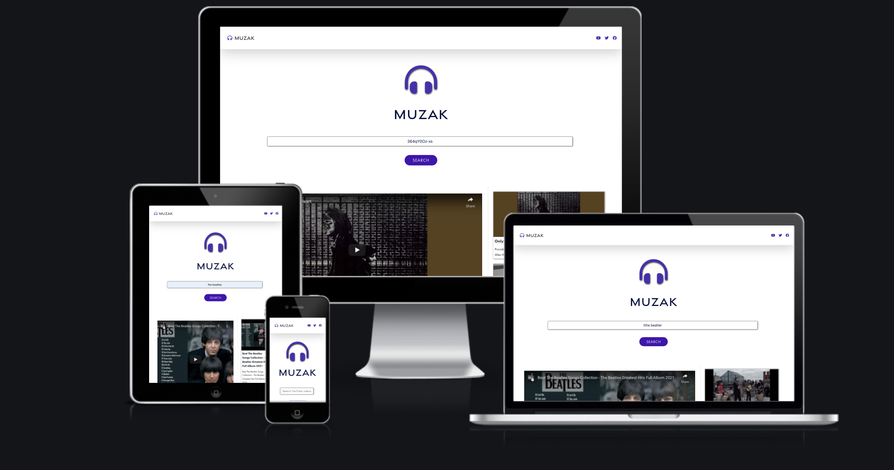

# Muzak

[Link to Live Site](https://muzak.netlify.app/)

[Link to GitHub Repository](https://github.com/alissatroiano/Junior-Dev-Test)

## Description

Muzak is a simple video player that uses the YouTube Data API to fetch & stream videos by video ID or title. Muzak was created for the [Blingby](https://blingby.com) Junior Developer programming test.

## Wireframes

The following wireframe was created to guide this project:

You can also view it as a PDF [here](docs/wireframes/muzak-wireframe.pdf)

### Features

1. Video Search: Search for videos by title or video ID

2. Video Player: Play videos by video ID or title

3. Video List: Muzak fetches up to 5 videos from YouTube and displays them in a list alongside the main video player

4. Video ID Logs to Console: Due to time constraints, Muzak only logs video ID's to the console at this point in time. To view the video ID's, open the console and click on a video from the list.

## Technologies

- [React](https://reactjs.org/)
- [Bootstrap 5](https://getbootstrap.com/)
- [HTML](https://www.w3.org/TR/html5/)
- [CSS](https://www.w3.org/Style/)
- [Git](https://git-scm.com/)
- [GitHub](https://github.com/)
- [Netlify](https://www.netlify.com/)

## Deployment

- Muzak was deployed with [Netlify](https://www.netlify.com/). To see the live site, click the link below:

- [Muzak Live Site](https://muzak.netlify.app/)

## Credits

- [Youtube API](https://developers.google.com/youtube/v3/docs/videos/list) - Documentation used to obtain information about using the YouTube API

- [Boompositive](https://boompositive.com/blogs/positivethesaurus/synonyms-for-music-words) - Was used to brainstorm the app name, Muzak.

- [HTML Standard](https://html.spec.whatwg.org/multipage/links.html#link-type-noopener) was used to obtain information about repairing security vulnerabilities in the `target=_blank` attribute.

- The API Key was obtained from the Google Developers Console [Google Developers Console](https://console.developers.google.com/).

## Acknowledgements

- This project was created for the [Blingby](https://blingby.com) junior developer programming test.